# Anforderungs- und Entwurfsspezifikation ("Pflichtenheft")

# 0 Titelseite

* Projektname
* Autoren (Vor- und Nachnamen der beteiligten Studierenden)
* Link zum Source Code Repository
* Inhaltsverzeichnis

# 1 Einführung

## 1.1 Beschreibung

# Unsere Produktidee

Wir möchten eine Plattform anbieten, mit der Menschen ihren Standort sicher und einfach mit ihren Mitmenschen teilen können.
Dabei ist es uns wichtig, ein breites Publikum zu erreichen – für mehr Verbindung, Vertrauen und Sicherheit im Alltag.

## Zielgruppen

Unsere App richtet sich an:

* Familien, die sich gegenseitig absichern möchten
* Freunde oder Paare, die ihren Standort freiwillig teilen möchten
* Eltern, die sehen möchten, ob ihre Kinder sicher in der Schule angekommen sind
* Betreuungspersonen, die zum Beispiel Senioren begleiten oder betreuen

## Design und Energieeffizienz

Wir setzen auf ein minimalistisches Design mit dunklen Farben, um den Akkuverbrauch zu reduzieren.
Diese Gestaltung sorgt dafür, dass unsere App auch auf älteren Geräten energieeffizient und stabil läuft.

## Schwächen bestehender Lösungen

Viele existierende Standort-Apps stoßen auf wiederkehrende Kritik:

* Sie senden den Standort nicht zuverlässig im Hintergrund
* Sie verbrauchen zu viel Strom, besonders bei dauerhafter Nutzung
* Die Bedienung ist oft zu komplex für Kinder oder ältere Menschen

Unsere App löst diese Probleme gezielt durch technische und gestalterische Optimierungen.

## Sicherheit und Datenschutz

Wir verzichten bewusst auf Systeme mit E-Mail-Adressen oder Benutzernamen.
Stattdessen funktioniert die Verbindung über einen einmaligen Code, den beide Nutzer gegenseitig austauschen.
Die erfolgt entweder durch Scannen oder manuelle Eingabe.

Der Code basiert auf einem sicheren SHA-256 Hash. Damit erhöhen wir die Sicherheit und erschweren unbefugten Zugriff durch Dritte.

## Standortfreigabe und Statusanzeige

* Jeder Nutzer kann bis zu fünf Personen (Observer) Zugriff auf seinen Standort geben
* Die Koordinaten werden alle zehn Minuten aktualisiert
* Ein Ampelsystem ermöglicht es, den eigenen Status situationsbedingt mitzuteilen
(zum Beispiel: grün = alles in Ordnung, rot = Gefahr)

**Warum nur fünf Observer?**
Die Begrenzung auf fünf Kontakte sorgt für gezielte Freigaben, erhöht die Übersicht und schützt die Privatsphäre.

## Einfache Bedienung für alle Altersgruppen

Die Benutzeroberfläche wird bewusst einfach gehalten.
So können auch Kinder, Senioren und technisch unerfahrene Personen die App problemlos nutzen.

## Zugriff auf ältere Daten im Notfall

Frühere Standortdaten werden sicher auf unseren Servern gespeichert.
Im Ernstfall – etwa bei einer vermissten Person – kann auf diese Daten zugegriffen werden,
um sie beispielsweise der Polizei oder Angehörigen zur Verfügung zu stellen.

# 2 Anforderungen

## 2.1 Stakeholder

| Funktion / Relevanz | Name | Kontakt / Verfügbarkeit | Wissen | Interessen / Ziele |
| ------------------- | ---- | ----------------------- | ------ | ------------------ |
| Entwickler und Gesellschafter, Verantwortlicher für die App-Entwicklung (Frontend, Android-Client) | Matteo Antonuccio | matteo@antozstudios.de, Montag bis Freitag von 8 bis 18 Uhr erreichbar, Herford | Entwickelt das Frontend und den Android-Client der App | Erfolgreiche Markteinführung der App, benutzerfreundliche Oberfläche |
| Entwickler und Gesellschafter, Verantwortlicher für das Backend und Management-Seite | Moritz Luetzkendorf | moritz@antozstudios.de, Montag bis Freitag von 8 bis 18 Uhr erreichbar, Herford | Verantwortlich für das Backend und das Bauen der Management-Seite | Stabile Infrastruktur und effizientes Backend für die App und Webclient |
| Testpartner (Altenheime), Feedbackgeber zu Benutzerfreundlichkeit und Barrierefreiheit | Altenheim Herford | kontakt@altenheim-hanse.stadt.de, werktags erreichbar, Herford | Erfahrung in der Arbeit mit älteren Menschen, Fokus auf Barrierefreiheit und einfache Bedienung | Einfache Nutzung, hohe Akzeptanz bei älteren Nutzern, Verbesserung der Lebensqualität |
| Testpartner (Schulen), Feedbackgeber zu Nutzung und Kindersicherheit | Schule Hanse-Stadt Herford | kontakt@schule-hanse.stadt.de, werktags erreichbar, Herford | Erfahrung mit der Nutzung von Apps in Schulen, Fokus auf Sicherheit und Aufsicht | Einfache und sichere Bedienung für Kinder, Förderung von Vertrauen und Kontrolle |
| Regierung (Auftraggeber), Verantwortlich für die Projektfinanzierung und -überwachung | Herr Mustermann | Musterstrasse 10. Detmold 32756, werktags erreichbar, Detmold | Verantwortlich für die Finanzierung und Projektkoordination | Einhaltung der Projektziele, Datenschutz und Sicherheit für die Bürger |

## 2.2 Funktionale Anforderungen

* **Benutzerverwaltung**: Verwaltung von Benutzerkonten, einschließlich Registrierung, Verifizierung, Profilverwaltung und Account-Löschung.
* **Standortfreigabe**: Die Möglichkeit für den Benutzer, seinen Standort mit anderen zu teilen.
* **Standortaktualisierung**: Regelmäßige Aktualisierung des Standorts, um sicherzustellen, dass die geteilten Standortdaten aktuell sind.
* **Beenden der Freigabe**: Die Option für den Benutzer, die Standortfreigabe zu stoppen.
* **Notfallmanagement**: Zugriff auf frühere Standortdaten durch berechtigte Stellen im Notfall.
* **Zugriff auf frühere Standortdaten**: Zugriff auf historische Standortdaten durch autorisierte Stellen wie Polizei oder Angehörige im Falle eines Notfalls.
* **Technischer Support**: Unterstützung durch den technischen Support bei Problemen mit der App.
* **App-Funktionalitäten**: Die verschiedenen Funktionen der App, die den Benutzern zur Verfügung stehen, z. B. Standortaktualisierungen, Notfallfunktionen und Hintergrundoperationen.
* **Hintergrundfunktionalität**: Die Fähigkeit der App, auch im Hintergrund weiter zu laufen und Daten zu aktualisieren.
* **Energieeffizienz**: Optimierung der App, um den Stromverbrauch während der Nutzung zu minimieren.

#### Funktionale Anforderungen in der Tabelle:

| Nr. | Titel / Kurzbeschreibung | Akteur(e) | Vorbedingung | Beschreibung / Ablauf | Ergebnis / Zielzustand | Priorität | Art der Anforderung |
| --- | ------------------------ | --------- | ------------ | --------------------- | ---------------------- | --------- | ------------------- |
| F1 | Standortfreigabe | Benutzer | Benutzer ist angemeldet | Der Benutzer kann seinen aktuellen Standort mit Personen teilen. | Standort wird für ausgewählte Kontakte sichtbar. | Hoch | Funktional |
| F2 | Ampel-Status senden | Benutzer | App geöffnet, Benutzer ist angemeldet | Der Benutzer kann den Status "Grün", "Gelb" oder "Rot" über ein Ampelsystem setzen. | Der Status wird in Echtzeit an die Kontakte übermittelt. | Hoch | Funktional |
| F3 | Automatische Standortaktualisierung | System | Standortfreigabe aktiv | Die App aktualisiert alle 10 Minuten automatisch den Standort. | Standortdaten sind aktuell. | Hoch | Funktional |
| F4 | Kontakt per Code hinzufügen | Benutzer | App ist geöffnet | Benutzer kann andere durch Scannen eines Codes oder manuelle Eingabe hinzufügen. | Neuer Kontakt wird zur Liste hinzugefügt. | Mittel | Funktional |
| F5 | Hintergrundfunktionalität | System | App ist gestartet | Die App läuft zuverlässig im Hintergrund weiter, inklusive Standortüberwachung. | Funktionen bleiben auch bei Minimierung aktiv. | Hoch | Funktional |
| F6 | Zugriff auf frühere Standortdaten | Polizei, Angehörige, Regierung | Notfall liegt vor | Berechtigte Personen können bei Notfällen vergangene Standortdaten abrufen. | Historie ist einsehbar und nachvollziehbar. | Hoch | Funktional |
| F7 | Standortfreigabe stoppen / pausieren | Benutzer | Freigabe ist aktiv | Der Benutzer kann jederzeit die Standortfreigabe pausieren oder vollständig beenden. | Standort wird nicht mehr geteilt. | Hoch | Funktional |
| F8 | Technischer Support bei Problemen | Technischer Support | Problem wurde gemeldet | Technischer Support hilft bei technischen Schwierigkeiten mit der App. | Problem ist gelöst, Nutzer erhält Unterstützung. | Mittel | Funktional |
| F9 | Behördenzugriff nur mit Sonderfreigabe | Polizei, Regierung | Notfall & Berechtigung liegt vor | Behörden erhalten ausschließlich im Notfall mit gesonderter Genehmigung Zugriff auf Standortdaten. | Datenschutz ist gewahrt, Zugriff erfolgt nur bei Bedarf. | Hoch | Funktional |
| F10 | Energieeffizienz auf alten Geräten | System | App ist installiert | Die App ist so optimiert, dass sie auch auf älteren Geräten energieeffizient läuft. | Längere Akkulaufzeit, stabile Nutzung. | Mittel | Nicht-funktional |
| F11 | Einfache Bedienung für Kinder & Senioren | Benutzer | App ist installiert | Die Benutzeroberfläche ist intuitiv und vereinfacht für Kinder und ältere Personen. | Alle Nutzergruppen können die App nutzen. | Hoch | Nicht-funktional |
| F12 | Brief zur Verifizierung | System | Registrierung abgeschlossen | Nach Registrierung erhält der Nutzer per Post einen Brief mit Anweisungen zur Verifizierung. | Brief ist angekommen, Nutzer wird zur Verifizierung aufgefordert. | Hoch | Funktional |
| F13 | Verifizierung mit Ausweisdokument | Benutzer | Brief zur Verifizierung erhalten | Der Benutzer lädt zur Verifizierung eine Ausweiskopie hoch. | Nutzer gilt als verifiziert. | Hoch | Funktional |
| F14 | Freischaltung durch technischen Support | Technischer Support | Verifizierung erfolgreich abgeschlossen | Der Support prüft die Verifizierung und gibt den Nutzer anschließend für die App frei. | Nutzer kann App-Funktionen vollständig nutzen. | Hoch | Funktional |
| F15 | Manuelle Standortaktualisierung per Ampel | Benutzer | App geöffnet, Standortfreigabe aktiv | Wenn der Nutzer auf den Ampel-Status tippt, wird der Standort sofort manuell aktualisiert. | Neuer Standort wird sofort an Kontakte übertragen. | Mittel | Funktional |
| F16 | Account dauerhaft löschen | Benutzer | Benutzer ist angemeldet | Der Nutzer kann seinen Account samt aller Daten dauerhaft löschen. | Account und Daten werden vollständig entfernt. | Hoch | Funktional |

- - -

## 2.3 Nicht-funktionale Anforderungen

### 2.3.1 Rahmenbedingungen:

* **Datenschutz und Sicherheitsrichtlinien**: Die App muss alle relevanten Datenschutz- und Sicherheitsrichtlinien gemäß der DSGVO einhalten.
* **Kompatibilität**: Die App sollte auf gängigen mobilen Geräten (Android ab Version 14) lauffähig sein.

### 2.3.2 Betriebsbedingungen:

* **Android-Kompatibilität**: Die App muss auf Android-Geräten mit Version 14 und höher problemlos funktionieren.
* **Entwicklung**: Die App muss in Java für Android entwickelt werden.
* **Betriebssystem-Updates**: Die App sollte kontinuierlich mit den neuesten Betriebssystemupdates kompatibel bleiben.

### 2.3.3 Qualitätsmerkmale:

| Qualitätsmerkmal | sehr gut | gut | normal | nicht relevant |
| ---------------- | -------- | --- | ------ | -------------- |
| **Zuverlässigkeit** |  |  |  | X |
| **Fehlertoleranz** | X |  |  |  |
| **Wiederherstellbarkeit** | X |  |  |  |
| **Ordnungsmäßigkeit** | X |  |  |  |
| **Richtigkeit** | X |  |  |  |
| **Konformität** |  | X |  |  |
| **Benutzerfreundlichkeit** |  |  |  | X |
| **Installierbarkeit** |  |  | X |  |
| **Verständlichkeit** | X |  |  |  |
| **Erlernbarkeit** |  | X |  |  |
| **Bedienbarkeit** |  | X |  |  |
| **Performance** |  |  | X |  |
| **Zeitverhalten** |  |  | X |  |
| **Effizienz** |  |  |  | X |
| **Sicherheit** | X |  |  |  |
| **Analysierbarkeit** | X |  |  |  |
| **Modifizierbarkeit** |  |  |  | X |
| **Stabilität** | X |  |  |  |
| **Prüfbarkeit** | X |  |  |  |

## 2.4 Graphische Benutzerschnittstelle

### User Stories für die Benutzeroberfläche
Hier sind die User Stories, die die Funktionalität der Benutzeroberfläche beschreiben:

1. **Registrierung und Verifizierung**  
   - **Ziel**: Ein einfaches Registrierungsformular zur Kontoerstellung.  
   - **Akzeptanzkriterien**: Eingabe von E-Mail, Passwort, Vorname, Nachname, Wohnort, Straße, PLZ und eine Verifizierungs-E-Mail nach der Registrierung.  
   - 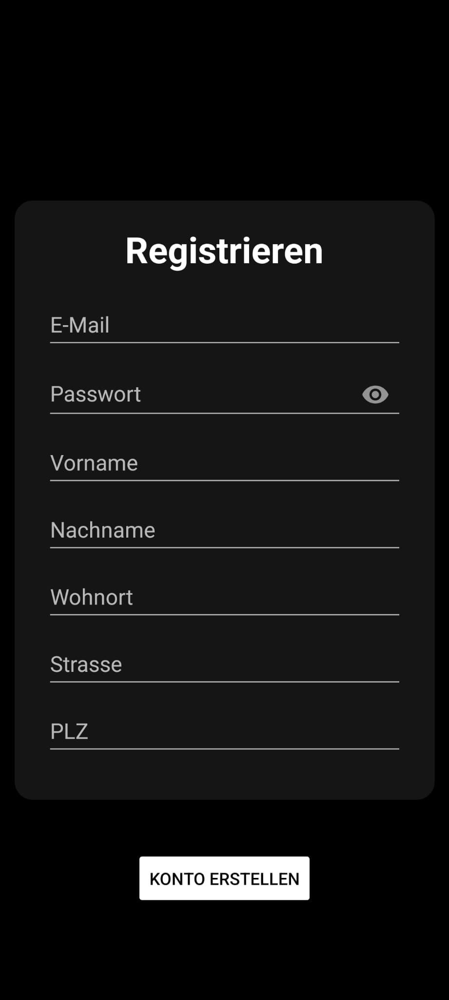

2. **Standortfreigabe**  
   - **Ziel**: Möglichkeit, den eigenen Standort zu teilen und zu kontrollieren, wer Zugriff hat.  
   - **Akzeptanzkriterien**: Standort wird alle 10 Minuten geteilt, und es gibt eine Möglichkeit, Personen zu entfernen.  
   - 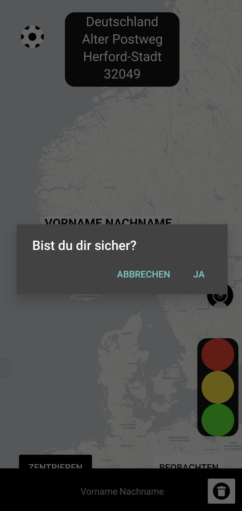

3. **Ampel-Status setzen**  
   - **Ziel**: Benutzer können ihren Status in Form eines Ampelsystems anpassen.  
   - **Akzeptanzkriterien**: Die Auswahl der Farben (Grün, Gelb, Rot) und Echtzeit-Übertragung an andere.  
   - 

4. **Standortfreigabe pausieren oder stoppen**  
   - **Ziel**: Möglichkeit, die Standortfreigabe jederzeit zu stoppen.  
   - **Akzeptanzkriterien**: Button „Beenden“ zum Stoppen des Hintergrundservices und die sofortige Beendigung der Standortfreigabe.  
   - 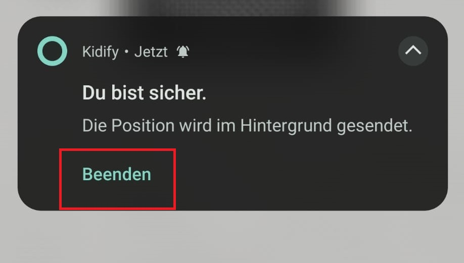

5. **Benutzerfreundlichkeit für Kinder und Senioren**  
   - **Ziel**: Benutzeroberfläche, die einfach zu bedienen ist, insbesondere für Kinder und Senioren.  
   - **Akzeptanzkriterien**: Klare Struktur mit großen Schaltflächen und einfachen Symbolen.  
   - 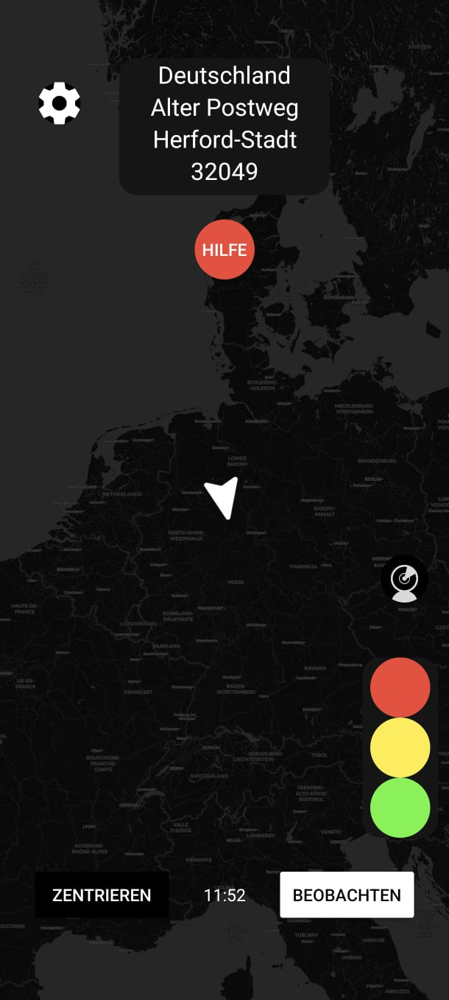

6. **Technischer Support**  
   - **Ziel**: Einfache Möglichkeit, auf den technischen Support zuzugreifen.  
   - **Akzeptanzkriterien**: Ein sichtbarer Support-Button und telefonischer Support.  

7. **Account dauerhaft löschen**  
   - **Ziel**: Benutzer können ihr Konto vollständig löschen.  
   - **Akzeptanzkriterien**: Möglichkeit, den Account über Einstellungen zu löschen und Bestätigung, dass der Account und die Daten entfernt wurden.  
   - 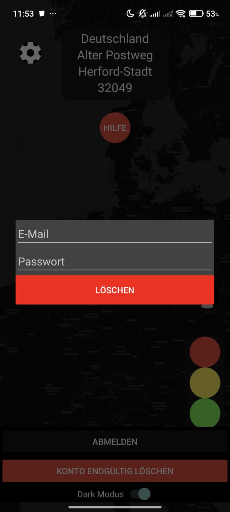

8. **Energieeffizienz auf den Geräten**  
   - **Ziel**: Die App soll möglichst wenig Energie verbrauchen.  
   - **Akzeptanzkriterien**: Die App verbraucht weniger Energie durch den Einsatz eines Hintergrundservices.  
   - 

9. **Verifizierung mit Ausweisdokument**  
   - **Ziel**: Der Benutzer kann sein Konto mit einem Ausweisdokument verifizieren.  
   - **Akzeptanzkriterien**: Der Benutzer sendet ein Foto eines Ausweisdokuments und erhält eine Bestätigung nach der Verifizierung.  
   - 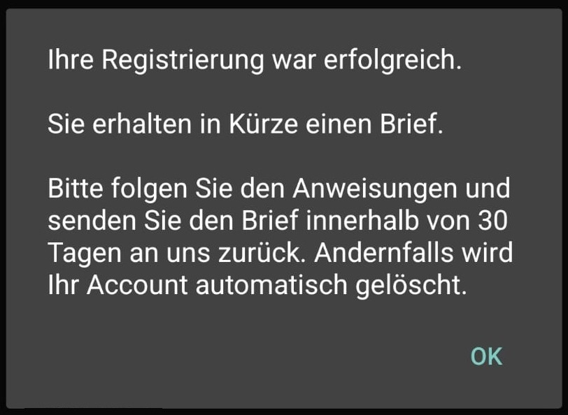

---

## 2.5 Anforderungen im Detail

In diesem Abschnitt werden die **detaillierten Anforderungen** beschrieben, die die Funktionalität und Sicherheit der App betreffen. Hier geht es um die **genauen Akzeptanzkriterien**, Prioritäten und mögliche **Misuse-Stories** (Missbrauchsszenarien).

### Funktionale Gruppen mit User Stories

**A. Registrierung & Verifizierung**
1. **Registrierung und Verifizierung**  
   - **ID**: A1  
   - **Priorität**: Must  
   - **Akzeptanzkriterien**: Formular mit den nötigen Feldern und eine Verifizierung durch E-Mail.

2. **Verifizierung mit Ausweisdokument**  
   - **ID**: A2  
   - **Priorität**: Should  
   - **Akzeptanzkriterien**: Foto des Ausweisdokuments wird kopiert und an uns versendet.

---

**B. Standort & Kontrolle**
1. **Standortfreigabe steuern**  
   - **ID**: B1  
   - **Priorität**: Must  
   - **Akzeptanzkriterien**: Standortfreigabe alle 10 Minuten und Möglichkeit, Benutzer zu entfernen.

2. **Standortfreigabe pausieren oder stoppen**  
   - **ID**: B2  
   - **Priorität**: Must  
   - **Akzeptanzkriterien**: Button zum Stoppen der Standortfreigabe und der Hintergrundservices.

---

**C. Statusanzeige & Kommunikation**
1. **Ampel-Status setzen**  
   - **ID**: C1  
   - **Priorität**: Must  
   - **Akzeptanzkriterien**: Auswahl von verschiedenen Ampelzustände und Echtzeit-Statusaktualisierung.

---

**D. Benutzerfreundlichkeit & Usability**
1. **Benutzerfreundliche Oberfläche für Kinder und Senioren**  
   - **ID**: D1  
   - **Priorität**: Must  
   - **Akzeptanzkriterien**: Eine klare Benutzeroberfläche mit großen Schaltflächen und verständlichen Symbolen.

2. **Technischer Support**  
   - **ID**: D2  
   - **Priorität**: Should  
   - **Akzeptanzkriterien**: Ein leicht zugänglicher Support-Button und telefonischer Kontakt.

---

**E. Datenschutz & Energieeffizienz**
1. **Account dauerhaft löschen**  
   - **ID**: E1  
   - **Priorität**: Must  
   - **Akzeptanzkriterien**: Der Benutzer kann den Account löschen und erhält eine Bestätigung.

2. **Energieeffizienz**  
   - **ID**: E2  
   - **Priorität**: Could  
   - **Akzeptanzkriterien**: Energieeffizienz durch Hintergrunddienste.

---

### Misuse-Stories (Sicherheit)

1. **Standortfreigabe durch Unbefugte**  
   - *Als System möchte ich verhindern, dass nicht autorisierte Nutzer den Standort anderer sehen können, um Datenschutzverletzungen zu vermeiden.*

2. **Unautorisierte Accountlöschung**  
   - *Als System möchte ich verhindern, dass Dritte ohne Bestätigung einen Account löschen, um Datenmissbrauch zu vermeiden.*

3. **Spam durch Fake-Accounts**  
   - *Als System möchte ich verhindern, dass Fake-Accounts erstellt werden, um Spam zu vermeiden – durch Ausweis- oder Briefverifizierung.*

---

# 3 Technische Beschreibung

## 3.1 Systemübersicht

* Systemarchitekturdiagramm ("Box-And-Arrow" Diagramm)
* Kommunikationsprotokolle, Datenformate
Das Diagramm in Kapitel "Systemübersicht" ist statisch und nicht dynamisch und stellt
daher keine Abläufe dar. Abläufe werden im Kapitel "Abläufe" dargestellt. Im Kapitel
"Systemübersicht" soll genau ein Diagramm dargstellt werden. Das "Box-and-Arrow"-Diagramm
soll als Systemarchitekturdiagramm eine abstrakte Übersicht über das Softwaresystem
geben. Dazu stellt es die Rechnerknoten und deren Kommunikationsbeziehungen (Protokoll
(z.B. HTTP), Datenformat (z.B. JSON)) dar. Also Rechtecke und gerichtete Pfeile. Ähnlich
einem UML-Deployment-Diagramm, aber noch abstrakter, denn es zeigt nicht die Verteilung
der Softwarebausteine auf die Rechnerknoten. So erlangt der Leser einen schnellen und
guten Überblick über das Softwaresystem.

## 3.2 Softwarearchitektur

* Darstellung von Softwarebausteinen (Module, Schichten, Komponenten)
Hier stellen Sie die Verteilung der Softwarebausteine auf die Rechnerknoten dar. Das ist
die Softwarearchitektur. Zum Beispiel Javascript-Software auf dem Client und JavaSoftware auf dem Server. In der Regel wird die Software dabei sowohl auf dem Client als
auch auf dem Server in Schichten dargestellt.
* Server
* Web-Schicht
* Logik-Schicht
* Persistenz-Schicht
* Client
* View-Schicht
* Logik-Schicht
* Kommunikation-Schicht
Die Abhängigkeit ist bei diesen Schichten immer unidirektional von "oben" nach "unten".
Die Softwarearchitektur aus Kapitel "Softwarearchitektur" ist demnach detaillierter als
die Systemübersicht aus dem Kapitel "Systemübersicht". Die Schichten können entweder als
Ganzes als ein Softwarebaustein angesehen werden. In der Regel werden die Schichten aber
noch weiter detailliert und in Softwarebausteine aufgeteilt.

### 3.2.1 Technologieauswahl

Beschreiben Sie hier, welche Frameworks / Technologien / Bibliotheken / Datenformate /
Protokolle benutzt werden.

### Android Client:

Für die Entwicklung unseres Android-Clients verwenden wir eine Vielzahl von Bibliotheken, die sowohl Standardbibliotheken von Google Android Studio als auch benutzerhinzugefügte Bibliotheken umfassen. Das Datenpaket für die Kommunikation umfasst folgende wichtige Elemente:

## Standardbibliotheken von Google Android Studio

- **Google Material Components** – 1.11.0  
- **ConstraintLayout** – 2.1.4  
- **Jetpack Compose Foundation** – 1.6.3  
- **AndroidX Test Espresso Intents** – 3.6.1  
- **AndroidX Test JUnit** – 1.2.1  
- **AndroidX Legacy Support v4** – 1.0.0  
- **AndroidX Multidex** – 2.0.1  
- **Desugar JDK Libs** – 2.0.2  
- **JUnit** – 4.13.2  

## Hinzugefügte Bibliotheken

- **OkHttp** – 4.12.0  
- **OSMDroid** – 6.1.18  
- **Firebase Crashlytics Build Tools** – 3.0.3  
- **Gson** – 2.10.1  
- **Jackson Databind** – 2.12.3  
- **ZXing Android Embedded** – 4.3.0  
- **Sceneform Filament** – 1.17.1  
- **Mockito Core** – 3.11.2  
- **Mockito Core** – 5.11.0  
- **Mockito Inline** – 5.2.0  
- **Hamcrest** – 2.2  

## 3.3 Schnittstellen

### Android Client:
Der Android-Client nutzt insgesamt zwei APIs zur Kommunikation:

* Unsere hauseigene API, die für das Speichern von Nutzerdaten verantwortlich ist, wie zum Beispiel Koordinaten.
* Die Koordinaten werden in Form von Längen- und Breitengraden verarbeitet.
* Zusätzlich verwenden wir die kostenlose Reverse-Geocoding-API "Nominatim" von OpenStreetMap.
* Diese API wandelt die Koordinaten in lesbare Adressen um.

## 3.3.1 Ereignisse

* In Event-gesteuerten Systemen: Definition der Ereignisse und deren Attribute

## 3.4 Datenmodell

* Konzeptionelles Analyseklassendiagramm (logische Darstellung der Konzepte der
Anwendungsdomäne)
* Modellierung des physikalischen Datenmodells
* RDBMS: ER-Diagramm bzw. Dokumentenorientiert: JSON-Schema

## 3.5 Abläufe

* Aktivitätsdiagramme für relevante Use Cases

### Android Client

### 1. **Service Status Diagramm**
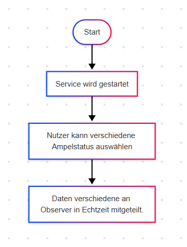  
*Beschriftung:* Aktivitätsdiagramm zur Verwaltung des Service-Status der App (z. B. zur Energieeffizienz, Hintergrunddiensten).

---

### 2. **Ampel-Status Diagramm**
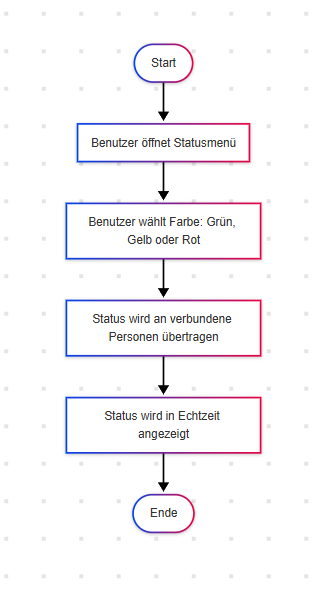  
*Beschriftung:* Diagramm für die Verwaltung des Ampel-Status, der den aktuellen Zustand (Grün, Gelb, Rot) für den Benutzer anzeigt.

---

### 3. **Konto löschen Diagramm**
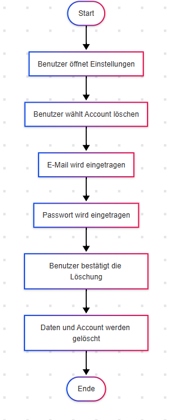  
*Beschriftung:* Diagramm für den Prozess, bei dem der Benutzer sein Konto dauerhaft löscht. Enthält Schritte wie Bestätigung und Datenlöschung.

---

### 4. **Standortfreigabe Diagramm**
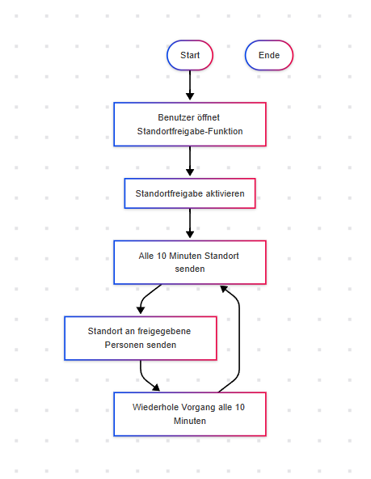  
*Beschriftung:* Aktivitätsdiagramm für die Standortfreigabe des Benutzers, mit Optionen zum Pausieren oder Beenden der Standortübertragung.

---

### 5. **Verifizierung mit Ausweisdokument Diagramm**
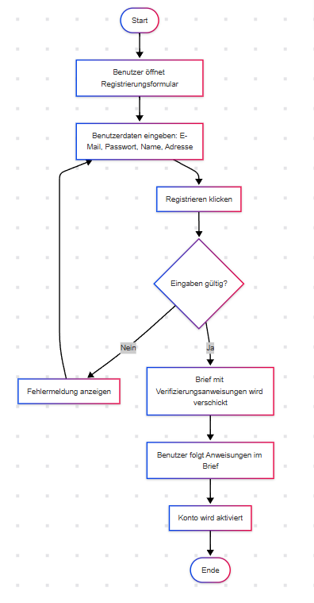  
*Beschriftung:* Diagramm, das den Prozess der Verifizierung des Benutzers mittels Ausweisdokument beschreibt, mit Fotoaufnahme und Bestätigung.

---

für die Darstellung der Interaktion von Akteuren der Use Cases / User Stories
* Abläufe der Kommunikation von Rechnerknoten (z.B. Client/Server)
in einem Sequenz- oder Aktivitätsdiagramm darstellen
* Modellieren Sie des weiteren die Diagramme, die für das (eigene) Verständnis des
Softwaresystems hilfreich sind.

## 3.6 Entwurf

* Detaillierte UML-Diagramme für relevante Softwarebausteine

### UML-Diagramm des Android Clientes

## 3.7 Fehlerbehandlung

* Mögliche Fehler / Exceptions auflisten
* Fehlercodes / IDs sind hilfreich
* Nicht nur Fehler technischer Art ("Datenbankserver nicht erreichbar") definieren,
sondern auch im Hinblick auf
Kapitel 3.8 sind fachliche Fehler wie "Kunde nicht gefunden". "Nachricht wurde bereits
gelöscht" o.ä.

## 3.8 Validierung

## 3.8 Validierung

### Relevante (Integrations)-Testfälle, die aus den Use Cases abgeleitet werden können

#### 1. **Service Status Diagramm**

**Testfall 1: Überprüfung des Service-Status**

- **Ziel:** Sicherstellen, dass der Service-Status korrekt aktualisiert wird.
- **Test:** 
  - Starte die App.
  - Überprüfe, ob der Service-Status im Dashboard korrekt angezeigt wird (z.B. "Aktiv", "Inaktiv").
  - Führe eine Änderung des Service-Status durch (z.B. durch manuelles Umschalten oder durch eine Systemaktion).
  - Überprüfe, ob die Änderung in der App reflektiert wird.

**Testfall 2: API-Integration für Service-Status**

- **Ziel:** Sicherstellen, dass die API den Service-Status korrekt liefert.
- **Test:**
  - Starte die App und rufe die API auf, die den Service-Status liefert.
  - Überprüfe, ob die API den richtigen Status liefert (z.B. "Aktiv", "Inaktiv").
  - Teste das Handling von Fehlern, wenn der API-Aufruf fehlschlägt.

---

#### 2. **Ampel-Status Diagramm**

**Testfall 1: Ampel-Status aktualisieren**

- **Ziel:** Sicherstellen, dass der Ampel-Status korrekt in der App angezeigt wird.
- **Test:** 
  - Starte die App und überprüfe, ob der Ampel-Status (Grün, Gelb, Rot) korrekt angezeigt wird.
  - Führe eine Aktion durch, die den Ampel-Status ändern sollte (z.B. eine Änderung der Parameter).
  - Überprüfe, ob der Ampel-Status entsprechend angepasst wird.

**Testfall 2: API-Integration für Ampel-Status**

- **Ziel:** Sicherstellen, dass die API den Ampel-Status korrekt liefert und aktualisiert.
- **Test:**
  - Überprüfe, ob die API den Ampel-Status korrekt zurückgibt.
  - Teste die API auf die korrekte Handhabung von Übergangszuständen (z.B. von "Gelb" zu "Rot").
  - Teste Fehlerbehandlung, wenn die API nicht erreichbar ist.

---

#### 3. **Konto löschen Diagramm**

**Testfall 1: Konto löschen Funktion**

- **Ziel:** Sicherstellen, dass der Benutzer sein Konto sicher löschen kann.
- **Test:** 
  - Starte die App und navigiere zum Konto löschen Bereich.
  - Initiere den Löschvorgang und überprüfe, ob der Benutzer zur Bestätigung aufgefordert wird.
  - Bestätige die Löschung und überprüfe, ob das Konto erfolgreich gelöscht wurde und alle zugehörigen Daten entfernt sind.

**Testfall 2: API-Integration für Konto löschen**

- **Ziel:** Sicherstellen, dass die API den Löschvorgang korrekt ausführt.
- **Test:**
  - Führe eine API-Anfrage aus, die das Löschen eines Kontos simuliert.
  - Überprüfe, ob die API den Löschvorgang erfolgreich abgeschlossen hat.
  - Teste Fehlerbehandlung, wenn das Löschen des Kontos fehlschlägt.

---

#### 4. **Standortfreigabe Diagramm**

**Testfall 1: Standortfreigabe Funktion**

- **Ziel:** Sicherstellen, dass der Benutzer seinen Standort korrekt freigibt.
- **Test:** 
  - Starte die App und überprüfe, ob der Standortfreigabe-Bereich sichtbar ist.
  - Starte die Standortfreigabe und überprüfe, ob der Standort korrekt übertragen wird.
  - Teste, ob der Benutzer die Freigabe pausieren oder stoppen kann und dass der Status korrekt angezeigt wird.

**Testfall 2: API-Integration für Standortfreigabe**

- **Ziel:** Sicherstellen, dass die API den Standort korrekt überträgt und verarbeitet.
- **Test:**
  - Teste die API auf die korrekte Übertragung des Standorts an den Server.
  - Überprüfe, ob der Standort korrekt gespeichert oder genutzt wird.
  - Teste das Pausieren und Stoppen der Standortübertragung über die API und stelle sicher, dass der Status korrekt wiedergegeben wird.

---

####

# 4 Projektorganisation

## 4.1 Annahmen

* Nicht durch den Kunden definierte spezifische Annahmen, Anforderungen und
Abhängigkeiten
* Verwendete Technologien (Programmiersprache, Frameworks, etc.)
* Aufteilung in Repositories gemäß Software- und Systemarchitektur und Softwarebausteinen
* Einschränkungen, Betriebsbedingungen und Faktoren, die die Entwicklung beeinflussen
(Betriebssysteme, Entwicklungsumgebung)
* Interne Qualitätsanforderungen (z.B. Softwarequalitätsmerkmale wie z.B.
Erweiterbarkeit)

## 4.2 Verantwortlichkeiten

* Zuordnung von Personen zu Softwarebausteinen aus Kapitel "Systemübersicht" und
"Softwarearchitektur"
* Rollendefinition und Zuordnung
\| Softwarebaustein \| Person\(en\) \|
\|\-\-\-\-\-\-\-\-\-\-\|\-\-\-\-\-\-\-\-\-\-\-\|
\| Komponente A \| Thomas Mustermann \|

### Rollen

Überlegen Sie, ob es sinnvoll ist, wenn Sie die Rollen für
Product-Owner und Scrum-Master vergeben, wobei Sie bedenken
sollten, ob diese Rollen über den gesamten Projektzeitraum
aktiv sein werden. Eine gleichzeitig Mischung von technischen
und organisatorischen Rollen ist meist kontroproduktiv. Eine
zeitlich getrennte Mischung (erst Rolle1, dann Rolle2) könnte
funktionieren. Neben den oben erwähnten Rollen können folgende
Rollen sinnvoll sein:

#### Softwarearchitekt

Entwirft den Aufbau von Softwaresystemen und trifft Entscheidungen über das Zusammenspiel
der Softwarebausteine.

#### Frontend-Entwickler

Entwickelt graphische oder andere Benutzerschnittstellen, insbesondere das Layout einer
Anwendung.

#### Backend-Entwickler

Implementiert die funktionale Logik der Anwendung. Hierbei werden zudem diverse
Datenquellen und externe Dienste integriert und für die Anwendung bereitgestellt.

#### Tester

Erstellt automatische Tests und führt manuelle Tests durch.

#### DevOps-Engineer

Ist für die Repositories und das Deployment verantwortlich.

### Rollenzuordnung

| Name | Rolle |
| ---- | ----- |
| Thomas Mustermann | Frontend-Entwickler |

## 4.3 Grober Projektplan

* Meilensteine

### Meilensteine

* KW 43 (21.10)
* Abgabe Pflichtenheft
* KW 44 (28.10) / Projekt aufsetzen
* Repository Struktur
* KW 45 (4.11) / Implementierung
* Implementierung #3 (Final)
* KW 48 (18.12) / Abnahmetests
* manuelle Abnahmetests
* Präsentation / Software-Demo

# 5 Anhänge

## 5.1 Glossar

* Definitionen, Abkürzungen, Begriffe

## 5.2 Referenzen

* Handbücher, Gesetze
* z.B. Datenschutzgrundverordnung

## 5.3 Index